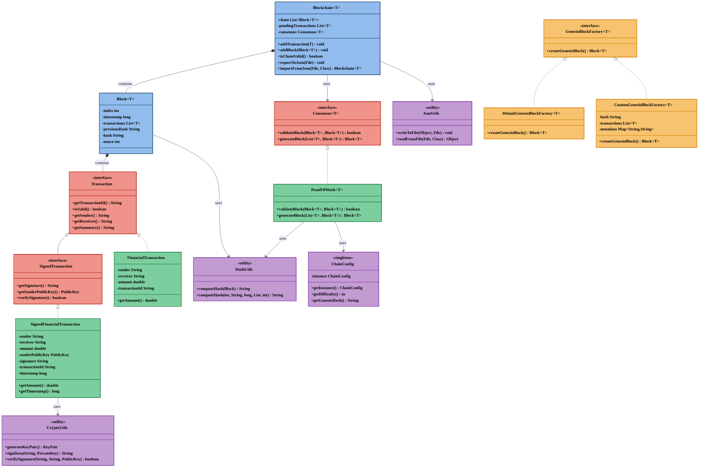

# Modular Blockchain Java

A lightweight, pluggable, and customizable **private blockchain framework** written in Java.

This project is designed for developers, researchers, and educators who want to **define their own consensus algorithms** and **transaction formats** while building a fully functional private blockchain.

> Think of this as a blockchain *engine*, not a coin. No tokens. Just logic.

---

## Table of Contents

- [Overview](#-overview)
- [Core Features](#-core-features)
- [Digital Signatures & Chain Validation](#-digital-signatures--chain-validation)
- [Automatic Persistence](#-automatic-persistence)
- [Architecture Overview](#️-architecture-overview)
- [Example Use Case](#-example-use-case)
- [How to Run](#-how-to-run)
- [Key Packages](#-key-packages)
- [Utility Classes](#-utility-classes)
- [Configuration](#️-configuration)
- [Logging](#-logging)
- [Customizing the Blockchain](#️-customizing-the-blockchain)
  - [Define Your Own Transaction Type](#-1-define-your-own-transaction-type)
  - [Implement or Plug in a Consensus Algorithm](#-2-implement-or-plug-in-a-consensus-algorithm)
  - [Customize Genesis Block](#-3-customize-genesis-block)
- [Testing](#-testing)
- [Planned Features](#-planned-features-future-phases)
- [Technologies Used](#️-technologies-used)
- [Contributing](#-contributing)
- [License](#-license)
- [Inspiration](#-inspiration)

---

## 🚀 Overview

`modular-blockchain-java` is a modular and extensible blockchain skeleton that allows you to:

- 🔧 Plug in your own **consensus algorithm** (e.g., Proof of Work, Authority, or Custom)
- 💼 Define your own **transaction structure**
- 🧠 Experiment with blockchain logic, block creation, and chain validation
- 🧪 Run a simple, in-memory blockchain for development or testing

---

## 🧱 Core Features

| Feature                     | Description                                                                  |
|----------------------------|------------------------------------------------------------------------------|
| 🧩 Pluggable Consensus      | Use or implement your own logic via `Consensus<T>` interface                 |
| 💬 Custom Transaction Type | Implement the `Transaction` interface to define your own domain-specific data |
| 🧠 Generic Blockchain Core  | Built using Java generics for flexibility and clean separation                |
| 🧪 In-Memory Blockchain     | Lightweight, runs without external dependencies                              |
| 🔐 SHA-256 Hashing          | Secure hashing mechanism for PoW/validation                                  |
| ⚙️ Environment-based Config | Customize difficulty and other parameters per environment                    |
| 🧿 Customizable Genesis     | Define your own genesis block with custom transactions and metadata          |
| 💾 JSON Serialization       | Export and import blockchain data to/from JSON files                          |
| 💿 Automatic Persistence    | Blockchain state is saved on shutdown and restored on startup                |
| 📝 Structured Logging       | SLF4J logging with environment-specific configurations                       |
| 🧪 Comprehensive Testing    | JUnit 5 test suite with high coverage for all components                     |

---

## 🔐 Digital Signatures & Chain Validation

The blockchain now supports **transaction-level digital signatures** using RSA.

### Key Enhancements

- **SignedTransaction Interface**  
  Introduced `SignedTransaction` to define contracts for verifiable transactions.

- **SignedFinancialTransaction**  
  A concrete class implementing signature verification for financial transfers.

- **CryptoUtils**  
  Utility for RSA keypair generation, signing, and verifying messages.

- **Chain Validation**  
  `isChainValid()` now ensures:
  - All blocks are sequential
  - All hashes match computed ones
  - All signed transactions are verified

## 💾 Automatic Persistence

The blockchain now includes **automatic state persistence** between application runs.

### Key Features

- **PersistenceManager**  
  Utility class that handles saving and loading blockchain state.

- **Configurable Persistence**  
  Enable/disable persistence and specify storage location via configuration.

- **Automatic Lifecycle Integration**  
  Blockchain state is automatically saved on shutdown and loaded on startup.

- **Error Handling**  
  Graceful handling of missing, corrupted, or invalid persistence files.

- **Validation Before Persistence**  
  Only valid blockchains are persisted to prevent corruption.

---

## 🏗️ Architecture Overview



**Key Relationships:**
- `Blockchain<T>` orchestrates the entire system
- `Block<T>` contains transactions and links to previous blocks
- `Consensus<T>` defines block creation and validation rules
- `Transaction` interface allows custom transaction types
- `SignedTransaction` extends Transaction to add digital signature verification
- `GenesisBlockFactory<T>` creates the initial block
- `CustomGenesisBlockFactory<T>` provides customizable genesis block creation
- `BlockUtils` handles hash computation for blocks
- `CryptoUtils` manages cryptographic operations for digital signatures

---

## 🔁 Example Use Case

Let's say you want to create a **financial ledger**. You would:

1. Implement your own `FinancialTransaction` class.
2. Use the built-in `ProofOfWork` consensus (or write your own).
3. Optionally create a custom genesis block with initial balances.
4. Add transactions and generate new blocks via the consensus plugin.
5. Export your blockchain to JSON for persistence or analysis.

Here's an example from the `Main.java`:

```java
// Create a new blockchain with financial transactions
Blockchain<FinancialTransaction> blockchain = new Blockchain<>();
// Use the built-in Proof of Work consensus algorithm
Consensus<FinancialTransaction> consensus = new ProofOfWork<>();

// Add some sample transactions
blockchain.addTransaction(new FinancialTransaction("Alice", "Bob", 100));
blockchain.addTransaction(new FinancialTransaction("Charlie", "Dave", 75));

// Generate a new block with the pending transactions
Block<FinancialTransaction> newBlock = consensus.generateBlock(
        blockchain.getPendingTransactions(),
        blockchain.getLastBlock()
);

// Validate and add the block to the chain
if (consensus.validateBlock(newBlock, blockchain.getLastBlock())) {
    blockchain.addBlock(newBlock);
    System.out.println("✅ Block added to chain");
}

// Export the blockchain to JSON file
try {
    blockchain.exportToJson(new File("blockchain.json"));
    System.out.println("✅ Blockchain exported to JSON");
    
    // Later, import the blockchain from JSON
    Blockchain<FinancialTransaction> importedChain = 
        Blockchain.importFromJson(new File("blockchain.json"), FinancialTransaction.class);
    System.out.println("✅ Blockchain imported with " + importedChain.getChain().size() + " blocks");
} catch (Exception e) {
    System.err.println("Error during JSON serialization: " + e.getMessage());
}
```

---

## 💻 How to Run

1. Clone this repo:

```bash
git clone https://github.com/yourusername/modular-blockchain-java.git
cd modular-blockchain-java
```

2. Build and run:

```bash
mvn clean install
mvn exec:java -Dexec.mainClass="com.example.blockchain.Main"
```

3. Use environment-specific configurations:

```bash
# Run with development configuration
mvn exec:java -Dexec.mainClass="com.example.blockchain.Main" -Dexec.args="blockchain-dev.properties"

# Or use environment variable
set BLOCKCHAIN_ENV=dev
mvn exec:java -Dexec.mainClass="com.example.blockchain.Main"
```

> 📘 For detailed run instructions including all CLI options, environment configurations, and troubleshooting tips, see the [Run Guide](docs/RunGuide.md)

---

## 📦 Key Packages

| Package                     | Purpose                                 |
|----------------------------|-----------------------------------------|
| `com.example.blockchain.core`          | Core block, chain, transaction logic    |
| `com.example.blockchain.consensus`     | Interfaces and algorithms for consensus |
| `com.example.blockchain.transactions`  | Your custom transaction types           |
| `com.example.blockchain.core.utils`         | Core utilities including JSON serialization |
| `com.example.blockchain.crypto`        | Cryptographic utilities and signatures   |
| `com.example.blockchain.logging`       | Logging configuration and utilities     |
| `com.example.blockchain.Main`          | Demo runner showing how it all works    |

## 🔧 Utility Classes

- `BlockUtils`: Encapsulates hash computation logic for blocks.
- `CryptoUtils`: Provides methods for RSA keypair generation, signing, and signature verification.
- `JsonUtils`: Handles JSON serialization and deserialization of blockchain data.

## ⚙️ Configuration

The blockchain uses a modular configuration system that allows for different settings per environment:

- **Default Configuration**: `blockchain.properties` in the root directory
- **Environment-specific**: `blockchain-dev.properties`, `blockchain-prod.properties`, etc.
- **Environment Variables**: `BLOCKCHAIN_DIFFICULTY`, `BLOCKCHAIN_GENESIS_HASH`
- **Runtime Selection**: Pass configuration file as command-line argument

### Configuration Properties

| Property             | Description                                      | Default            |
|---------------------|--------------------------------------------------|--------------------|
| `difficulty`         | Number of leading zeros required for PoW hashing | 4                  |
| `genesis_hash`       | Hash value used for the genesis block            | GENESIS_HASH       |
| `log_level`          | Logging level (TRACE, DEBUG, INFO, WARN, ERROR)  | INFO               |
| `persistence.enabled`| Enable automatic blockchain persistence          | true               |
| `persistence.file`   | File path for blockchain persistence storage     | data/chain-data.json |

### Usage in Code

```java
// Get the configuration singleton
BlockchainConfig config = BlockchainConfig.getInstance();

// Access configuration values
int difficulty = config.getDifficulty();
String genesisHash = config.getGenesisHash();

// Load a different configuration at runtime
config.setConfigFile("blockchain-dev.properties");
config.reloadConfig();
```

---

## 📝 Logging

The blockchain framework uses SLF4J with Logback for flexible and powerful logging:

- **Centralized Configuration**: Environment-specific logging settings
- **Multiple Log Levels**: TRACE, DEBUG, INFO, WARN, ERROR
- **File & Console Output**: Logs are written to both console and files
- **Configurable via Properties**: Change log levels without code modification

### Log Files

- `logs/blockchain.log`: Main log file (rotated daily)
- `logs/blockchain-dev.log`: Development environment logs (when using dev config)
- `logs/blockchain-prod.log`: Production environment logs (when using prod config)
- `logs/blockchain-error.log`: Error-specific logs (production only)

### Customizing Logs

You can configure logging behavior through:

1. **Configuration files**: Set the `log_level` property in blockchain.properties
2. **Environment-specific configs**: Use different logging profiles for dev/prod
3. **Runtime adjustment**: Use `LoggingUtils.setLogLevel()` to change log levels dynamically

Example of dynamically changing log levels:

```java
// Set blockchain package to DEBUG
LoggingUtils.setBlockchainLogLevel("DEBUG");

// Set a specific class to TRACE
LoggingUtils.setLogLevel("com.example.blockchain.consensus.ProofOfWork", "TRACE");
```

---

## ✍️ Customizing the Blockchain

For detailed instructions on customizing the blockchain, check out our [comprehensive customization guide](docs/CustomizationGuide.md).

### 🧱 1. Define Your Own Transaction Type

The project comes with a `FinancialTransaction` implementation, but you can create your own:

```java
public class CertificateTransaction implements Transaction {
    private String student;
    private String course;
    private String grade;

    public boolean isValid() {
        return student != null && course != null && grade != null;
    }

    public String getSender() {
        return "institution";
    }

    public String getReceiver() {
        return student;
    }

    public String getSummary() {
        return student + " earned " + grade + " in " + course;
    }
}
```

#### Creating Secure Signed Transactions

For enhanced security, implement the `SignedTransaction` interface to add digital signature verification:

```java
public class MySignedTransaction implements SignedTransaction {
    private final String sender;
    private final String receiver;
    private final String data;
    private final PublicKey senderPublicKey;
    private final String signature;
    
    // Constructor with signature generation
    public MySignedTransaction(String sender, String receiver, String data, 
                              KeyPair keyPair) throws Exception {
        this.sender = sender;
        this.receiver = receiver;
        this.data = data;
        this.senderPublicKey = keyPair.getPublic();
        this.signature = CryptoUtils.signData(this.getSummary(), keyPair.getPrivate());
    }
    
    @Override
    public boolean isValid() {
        return sender != null && receiver != null && verifySignature();
    }
    
    @Override
    public String getSender() { return sender; }
    
    @Override
    public String getReceiver() { return receiver; }
    
    @Override
    public String getSummary() { return sender + ":" + receiver + ":" + data; }
    
    @Override
    public String getSignature() { return signature; }
    
    @Override
    public PublicKey getSenderPublicKey() { return senderPublicKey; }
    
    @Override
    public boolean verifySignature() {
        return CryptoUtils.verifySignature(getSummary(), signature, senderPublicKey);
    }
}

---

### 🔁 2. Implement or Plug in a Consensus Algorithm

The project includes a `ProofOfWork` implementation with configurable difficulty. Here's how to implement your own:

```java
public class ProofOfStake<T extends Transaction> implements Consensus<T> {
    public boolean validateBlock(Block<T> newBlock, Block<T> previousBlock) {
        // Your custom validation logic here
    }

    public Block<T> generateBlock(List<T> txs, Block<T> previousBlock) {
        // Your block creation logic here
    }
}
```

---

### 🧿 3. Customize Genesis Block

The project allows customizing the genesis block (first block in the chain) through the `GenesisBlockFactory` interface:

```java
// Create a custom genesis block with initial transactions
CustomGenesisBlockFactory<FinancialTransaction> factory = 
    CustomGenesisBlockFactory.<FinancialTransaction>builder()
        .withHash("CUSTOM_GENESIS_HASH")
        .addTransaction(new FinancialTransaction("Genesis", "Alice", 1000))
        .addTransaction(new FinancialTransaction("Genesis", "Bob", 1000))
        .withMetadata("creator", "Satoshi")
        .build();

// Create blockchain with custom genesis block
Blockchain<FinancialTransaction> blockchain = new Blockchain<>(factory);
```

This allows for scenarios like:
- Pre-allocating tokens/assets in the genesis block
- Setting custom metadata for the blockchain's creation
- Creating different genesis blocks for different blockchain instances

---

## 🧪 Testing

The project includes comprehensive unit tests built with JUnit 5:

- `BlockchainTest`: Validates basic chain logic.
- `BlockUtilsTest`: Ensures consistent hash computation logic.
- `CryptoUtilsTest`: Verifies RSA key pair generation and digital signature functions.
- `SignedFinancialTransactionTest`: Confirms signature-based transaction validity.
- `BlockchainIntegrationTest`: Covers end-to-end scenarios including invalid chains.
- `BlockValidationTest`: Tests tampered transaction detection in blocks.
- `DynamicLoggingTest`: Verifies runtime log level changes.
- `BlockchainEdgeCasesTest`: Tests empty transaction lists and duplicate transactions.
- `ConfigErrorsTest`: Ensures robust handling of configuration errors.

Run the tests with:

```bash
mvn test
```

Generate test coverage reports with:

```bash
mvn verify
```

You can also run individual tests like:

```bash
mvn test -Dtest=CryptoUtilsTest
```

Or target a specific method:

```bash
mvn test -Dtest=SignedFinancialTransactionTest#testValidSignedTransaction
```

> 📘 For detailed instructions on running tests, debugging failures, and understanding mock transactions, see the [Test Guide](docs/TestGuide.md)


---

## 📚 Planned Features (Future Phases)

- 🌐 P2P networking using sockets or WebSocket
- 🧪 CLI-based or GUI simulation for testnets
- 📊 Web dashboard for monitoring the chain
- 🔄 Advanced DB-based storage (LevelDB, H2) beyond current JSON persistence

---

## 🛠️ Technologies Used

- Java 21 (as specified in pom.xml)
- Maven for build and dependency management
- Jackson for JSON serialization/deserialization
- JUnit 5 for testing
- JaCoCo for test coverage
- SHA-256 hashing

---

## 🤝 Contributing

Want to add a new consensus algorithm? Support SQLite or JSON file storage? Submit a pull request!  
This project is open to educational and experimental contributions.

> 📘 For guidelines on writing and running tests, see [`docs/TestGuide.md`](docs/TestGuide.md)

---

## 📄 License

MIT License. Use freely, modify deeply.

---

## 🧠 Inspiration

This project is inspired by the need for a **modular blockchain playground** — a tool that lets developers learn by building, not just by reading or cloning Web3 codebases.
